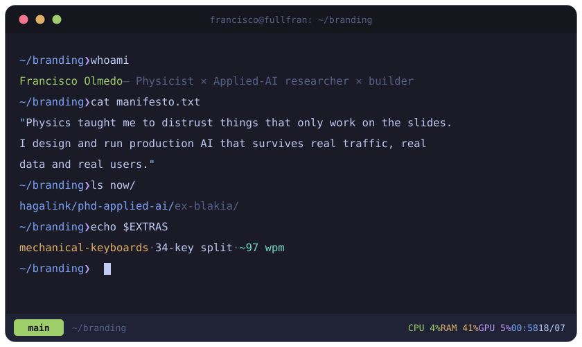

### Francisco Olmedo

**Physicist. I build AI systems that ship.**

Physics taught me to distrust things that only work on the slides. So now I
design and run production AI — the kind that survives real traffic, real data,
and real users.

**Currently** 
— Chief Data Scientist @ Hagalink — end-to-end AI systems 
— PhD candidate in applied AI @ Universidad de Córdoba · CIEMAT 
— Before: co-founded BlakIA — chatbots handling 100k+ weekly interactions

**Also** 
I'm way too into mechanical keyboards. I type on a 34-key split at ~97 wpm —
Vial/QMK, home-row mods, the works. 
→ [fullfran.com/fifi-keyboard-vial](https://www.fullfran.com/fifi-keyboard-vial/)

**What I care about** 
Architecture that survives contact with reality. Systems you can still reason
about at 3am. Less magic, more engineering.

**Elsewhere** 
CV → [fullfran.com/cv](https://www.fullfran.com/cv/) · [email](mailto:franciscomanuelolmedocortes@gmail.com)

<b>🇪🇸 En español</b>

 

**Físico. Construyo sistemas de IA que llegan a producción.**

La física me enseñó a desconfiar de lo que solo funciona en las diapositivas.
Así que ahora diseño y opero IA en producción — la que aguanta tráfico real,
datos reales y usuarios reales.

**Ahora mismo** 
— Chief Data Scientist @ Hagalink — sistemas de IA de punta a punta 
— Doctorando en IA aplicada @ Universidad de Córdoba · CIEMAT 
— Antes: cofundé BlakIA — chatbots con 100k+ interacciones semanales

**También** 
Me encantan los teclados mecánicos. Escribo en un split de 34 teclas a ~97 ppm
— Vial/QMK, home-row mods, y todo lo demás. 
→ [fullfran.com/fifi-keyboard-vial](https://www.fullfran.com/fifi-keyboard-vial/)

**Lo que me importa** 
Arquitectura que sobrevive al contacto con la realidad. Sistemas que todavía
puedes razonar a las 3am. Menos magia, más ingeniería.

**En otros sitios** 
CV → [fullfran.com/cv](https://www.fullfran.com/cv/) · [email](mailto:franciscomanuelolmedocortes@gmail.com)

